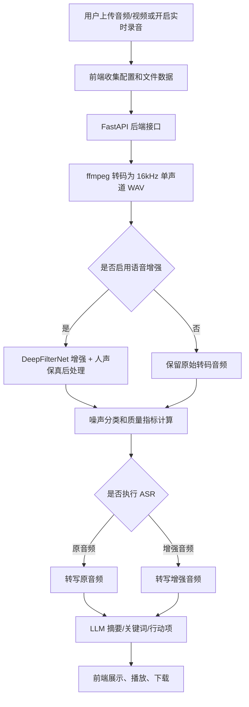
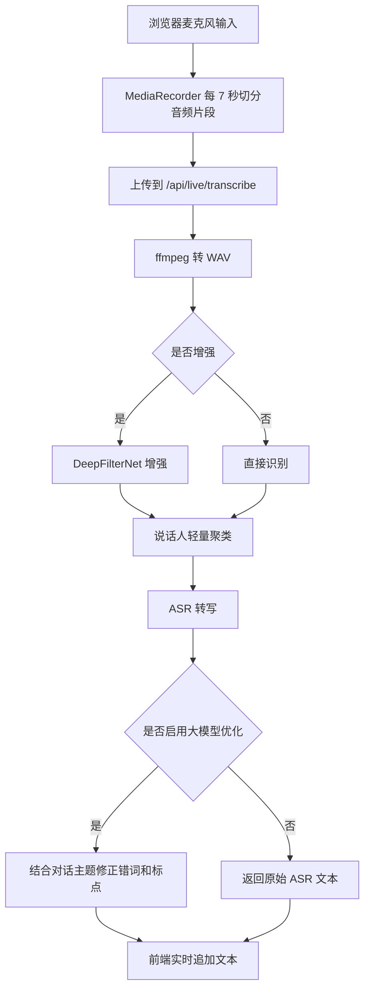

# ClearVoice 项目答辩说明文档

## 1. 项目概述

ClearVoice 是一个面向嘈杂环境录音的智能语音增强与转写系统。用户可以上传课堂、会议、采访、现场活动等音频或视频文件，系统完成音频格式统一、语音增强、噪声分析、语音转写、文本摘要、关键词提取和结果下载。同时，项目增加了实时录音转写模块，支持边录音边分段识别，并提供可选的增强转写、大模型优化和说话人标记能力。

项目重点解决三个问题：

1. 嘈杂环境下录音可听性差，直接听原音频效率低。
2. 普通 ASR 在噪声、人声重叠、专有名词较多时容易识别错误。
3. 用户需要从录音中快速获取文字、摘要、关键词和可下载文档。

系统最终目标不是只做一个单独模型调用界面，而是把“音频处理、识别、理解、下载、实时转写”整合成一条完整可演示的应用链路。

## 2. 应用场景

- 课堂录音整理：将授课录音转为文字，生成知识点摘要。
- 会议纪要生成：会议结束后快速获得转写文本、关键词和行动项。
- 采访材料处理：对采访录音进行降噪和初步整理。
- 嘈杂现场记录：对含有背景噪声的录音做增强后再识别。
- 实时字幕辅助：录音过程中分段转写，便于会议或讨论现场查看。

## 3. 技术栈

### 前端

- React：构建交互式页面。
- TypeScript：提高前端状态和接口数据的可维护性。
- Vite：前端开发和打包工具。
- lucide-react：提供按钮和功能区图标。
- Web APIs：使用 `MediaRecorder`、`getUserMedia`、`AudioContext` 完成浏览器录音和实时音量显示。

### 后端

- FastAPI：提供音频处理、转写、摘要和实时转写接口。
- Pydantic：定义接口数据结构和运行时配置。
- ffmpeg：将不同格式的音频或视频统一转码为 WAV。
- DeepFilterNet：执行语音增强和降噪。
- faster-whisper：本地语音识别方案。
- OpenAI SDK：兼容 OpenAI 风格的 ASR 和 LLM 服务。
- NumPy、soundfile：进行音频读取、指标计算、声学特征分析。
- websocket-client：用于讯飞 IAT 在线语音识别。

## 4. 总体架构

系统采用前后端分离结构：

- 前端负责文件选择、拖拽上传、配置参数、展示进度、播放音频、展示转写文本、下载结果和实时录音交互。
- 后端负责音频存储、转码、增强、噪声分析、ASR 调用、LLM 调用、文件访问和实时分段处理。
- 模型服务既支持本地模型，也支持云端 API。用户可以在 API 配置中心里填写 ASR 和 LLM 参数。

实时转写模块的数据流与文件上传不同，它采用分段录音：

## 5. 主要功能实现

### 5.1 文件上传与拖拽添加

前端支持点击选择文件和拖拽文件两种方式。用户上传音频或视频后，前端将文件和当前 API 配置一起提交给后端 `/api/audio/process` 接口。后端检查文件类型，保存到任务目录，并为每次处理生成独立的 `task_id`，避免不同用户或不同文件之间互相覆盖。

支持的输入类型包括常见音频和部分视频容器，例如 WAV、MP3、M4A、WEBM、MP4、FLAC、OGG、AAC 等。最终都通过 ffmpeg 统一转成后续模型更容易处理的 WAV 格式。

### 5.2 进度条与处理阶段展示

前端根据处理流程设计了阶段化进度，包括：

- 准备处理。
- 上传音频。
- 转码预处理。
- 语音增强。
- 噪声分析。
- 语音转写。
- 摘要生成。
- 处理完成。

由于部分外部 API 和模型没有提供逐帧进度回调，所以当前进度条是“阶段估计型进度”。它的作用是让用户知道系统正在执行哪一类任务，避免长时间等待时误以为程序卡死。

### 5.3 API 配置中心

页面右上角提供紧凑的 API 配置按钮，只展示当前 ASR 模型和 LLM 模型的简写信息。点击按钮后弹出居中的配置浮层，用户可以修改：

- ASR Provider。
- ASR Model。
- ASR API Key。
- ASR Base URL。
- 讯飞 App ID、API Key、API Secret。
- LLM API Key。
- LLM Base URL。
- LLM Model。
- 降噪强度 `atten_lim`。
- 是否增强原音频。
- 是否转写原音频。
- 是否转写增强音频。

配置保存在浏览器本地存储中，刷新页面后仍能保留，便于演示和重复使用。

### 5.4 原音频、增强音频和转写流程分离

系统将“增强”和“转写”拆开，用户可以自由组合：

- 只增强音频，不转写。
- 只转写原音频，不增强。
- 增强后只播放和下载增强音频。
- 增强后继续转写增强音频。
- 同时转写原音频和增强音频，用于对比识别效果。

这样设计的原因是：语音增强并不总是对 ASR 有利。有些录音中人声和噪声频率接近，过强降噪可能误删人声，所以系统允许用户根据场景决定是否对增强音频继续转写。

### 5.5 文本下载

系统为三类文本提供下载：

- 原音频转写文本。
- 增强音频转写文本。
- 大模型摘要文本。

下载格式支持 TXT、DOC、DOCX。实时录音转写模块也支持将合并后的转写内容下载为这三种格式。如果用户没有选择转写原音频，界面不会展示原音频转写文本的下载按钮，避免下载无意义的占位内容。

DOCX 的生成在前端完成：系统构造基本的 Word XML 文件结构，并用 ZIP 结构打包为 `.docx` 文件。这样不依赖后端额外库，适合轻量下载场景。

## 6. 核心处理原理

### 6.1 音频预处理

用户上传的音频格式不统一，采样率、声道数、编码方式都可能不同。为了让后续增强模型和 ASR 模型输入稳定，后端先调用 ffmpeg 转换为统一格式：

- WAV 容器。
- 单声道。
- 16kHz 采样率。
- PCM 音频数据。

统一格式的好处是减少模型报错，同时让噪声分析、SNR 估计、声学特征提取的计算方法更加稳定。

### 6.2 语音增强

语音增强主要使用 DeepFilterNet。它是面向语音降噪的深度学习模型，可以抑制背景噪声并尽量保留语音成分。系统将 `atten_lim` 暴露给用户，用于控制降噪强度。

实际测试中，过强的增强可能出现“消音严重”的问题，即噪声被去掉的同时，人声也被削弱。为了解决这个问题，项目增加了人声保真后处理：

- 对比原始音频和增强音频的 RMS 能量。
- 按降噪强度混入一定比例的原始信号。
- 如果增强后能量低于原始语音能量的安全比例，则提高保留比例。
- 最后限制峰值，避免输出爆音。

这种做法不是简单地让降噪更弱，而是在增强结果和原始人声之间做平衡，使增强音频更适合播放和后续识别。

### 6.3 噪声分类

系统对前若干秒音频做频谱分析，根据不同频段能量和过零率估计噪声类型：

- 低频能量占比较高：可能是风噪或机器低频噪声。
- 高频能量和过零率较高：可能是键盘声、高频嘶声。
- 中频能量占比较高：可能是人群嘈杂或背景说话声。
- 其他情况：归为宽频环境噪声。

该分类是轻量启发式分类，不依赖大型噪声分类模型。优点是速度快、部署简单；缺点是只能做粗粒度判断。

### 6.4 质量指标

系统输出以下指标帮助用户理解增强效果：

- SNR before：增强前估计信噪比。
- SNR after：增强后估计信噪比。
- SNR gain：增强前后信噪比变化。
- RMS before / after：增强前后整体能量变化。
- noise reduction ratio：根据噪声底能量估计的抑制比例。
- waveform peaks：用于前端绘制简化波形。

SNR 的估计方式是将音频切成短帧，使用较低能量分位数近似噪声底，较高能量分位数近似语音和信号，再计算二者比值。它适合做演示级对比，但不是严格实验室测量指标。

### 6.5 ASR 语音识别

系统设计为多 Provider 可切换，目前包含：

- `local-whisper`：本地 faster-whisper，适合无 API Key、离线或低成本演示。
- `openai`：OpenAI 官方 Whisper 接口。
- `openai-compatible`：兼容 OpenAI `/v1/audio/transcriptions` 的第三方中转服务。
- `groq`：Groq Whisper 接口。
- `fireworks`：Fireworks Whisper 接口。
- `dashscope-fun-asr`：阿里 Fun-ASR Flash。
- `xunfei`：讯飞 IAT 在线语音听写。

本地 faster-whisper 会优先检测 CUDA，如果可用则使用 GPU 和 `float16`，否则回退到 CPU 和 `int8`。云端 Provider 则通过用户填写的 API Key、Base URL 和模型名调用。

阿里 Fun-ASR 的实现重点是：

- 使用 DashScope 接口。
- 默认模型为 `fun-asr-flash-2026-06-15`。
- 将 WAV 音频编码为 Data URI 后提交。
- 对模型别名做归一化，减少用户填错模型名的概率。
- 对空语音、超时、HTTP 错误做提示。

讯飞 IAT 的实现重点是：

- 使用 WebSocket 接口。
- 通过 HMAC-SHA256 生成鉴权签名。
- 将 16kHz PCM WAV 分帧发送。
- 拼接服务端返回的识别片段。

### 6.6 LLM 摘要和实时校对

文件处理流程中，ASR 得到文本后，系统可以调用 LLM 生成：

- 摘要。
- 关键词。
- 行动项。

后端要求模型返回 JSON，便于前端结构化展示。如果用户没有配置 LLM API Key，系统会返回本地兜底说明，保证主流程不会因为 LLM 缺失而中断。

实时转写模块中，用户可以勾选“大模型优化转写”，并填写本次对话主题。后端会将 ASR 片段和主题一起传给 LLM，让模型修正常见错词、同音词、专有名词和标点断句。这里特别限制模型不要扩写、不要编造信息，只做校对。

## 7. 实时录音转写模块

实时转写模块是项目的独立 DLC 补充功能，主要文件是：

- `frontend/src/live/LiveTranscriptionPanel.tsx`
- `backend/app/routes/live_transcription.py`
- `backend/app/services/live_transcription.py`
- `backend/app/services/speaker_profile.py`

### 7.1 实时录音

前端通过浏览器 `getUserMedia` 获取麦克风权限，通过 `MediaRecorder` 录音。系统每 7 秒停止当前录音片段并立即开启下一段录音，使录音过程连续，同时让后端能够分段处理。

每个片段携带：

- session_id：当前录音会话。
- sequence：片段序号。
- ASR 配置。
- 是否启用实时增强。
- 是否启用 LLM 优化。
- 对话主题。

前端根据 sequence 排序展示，避免网络返回顺序不同导致文本错乱。

### 7.2 实时音量显示

前端使用 `AudioContext` 和 `AnalyserNode` 获取麦克风时域数据，计算 RMS，再换算为 dBFS 显示。dBFS 表示相对于数字音频满幅值的分贝值，所以常见范围是负数，例如 -60 dBFS 到 0 dBFS。显示复数值不是错误，而是数字音频电平的正常表示方式。

### 7.3 实时增强

用户可以勾选“增强后转写”。开启后，每个录音片段会先经过 DeepFilterNet 增强，再提交给 ASR。关闭后则直接转写原片段。

这个选项允许用户根据现场噪声选择策略：

- 背景噪声明显时，增强可能提高可懂度。
- 人声较弱或多人说话重叠时，增强可能误删部分人声，因此可以关闭。

### 7.4 说话人标记

实时模块支持说话人标记，例如“说话人 A”“说话人 B”。用户可以点击说话人标签，将其重命名为“小明”“老师”等名称，名称保存在浏览器本地存储中。

当前说话人标记是轻量声学聚类，不是严格声纹识别。系统提取每个片段中的主要人声特征，包括：

- 基频估计。
- 频谱质心。
- 频谱带宽。
- 过零率。
- 有声帧比例。

后端将这些特征与当前 session 中已有说话人中心点比较。如果距离超过阈值，就创建新的说话人标签；如果距离接近，就归入已有说话人，并更新该说话人的特征中心。

优点是实现轻量、无需训练、适合课堂项目演示。限制是多人同时说话、录音质量差、同一人音色变化较大时，标签可能不稳定。

## 8. 接口说明

### 8.1 健康检查

`GET /api/health`

用于检查后端是否启动成功。

### 8.2 文件完整处理

`POST /api/audio/process`

主要表单字段：

- `file`：上传的音频或视频文件。
- `asr_provider`：ASR 服务类型。
- `asr_api_key`：ASR API Key。
- `asr_base_url`：ASR Base URL。
- `asr_model`：ASR 模型名。
- `llm_api_key`：LLM API Key。
- `llm_base_url`：LLM Base URL。
- `llm_model`：LLM 模型名。
- `atten_lim`：降噪强度。
- `enhance_audio`：是否增强原音频。
- `transcribe_original`：是否转写原音频。
- `transcribe_enhanced`：是否转写增强音频。

返回内容包括：

- task_id。
- 原音频和增强音频 URL。
- 时长、采样率和波形峰值。
- 噪声类型和置信度。
- SNR、RMS、噪声抑制比例。
- 原音频转写和增强音频转写。
- LLM 摘要、关键词、行动项。

### 8.3 单独增强

`POST /api/audio/enhance`

只执行音频增强，不执行转写和摘要。

### 8.4 单独转写

`POST /api/audio/transcribe`

在已有 task_id 的基础上，对原音频或增强音频执行转写。

### 8.5 单独摘要

`POST /api/audio/summarize`

对给定文本执行 LLM 摘要、关键词和行动项提取。

### 8.6 音频文件访问

`GET /api/audio/file/{task_id}/{kind}`

`kind` 支持：

- `original`
- `enhanced`

### 8.7 实时转写

`POST /api/live/transcribe`

用于接收浏览器录音片段。主要字段包括：

- `file`：录音片段。
- `session_id`：实时会话 ID。
- `sequence`：片段序号。
- `live_enhance`：是否先增强再转写。
- `live_llm_optimize`：是否启用大模型校对。
- `live_topic`：本次对话主题。
- ASR 和 LLM 配置字段。

返回内容包括：

- session_id。
- sequence。
- text。
- raw_text。
- duration。
- enhanced。
- optimized。
- speaker_label。
- speaker_confidence。
- voice_activity。

## 9. 项目亮点

1. 音频增强和语音转写解耦，用户可以自由组合处理流程。
2. 支持本地 ASR 和多种云端 ASR，兼顾低成本、可扩展和演示稳定性。
3. 针对 DeepFilterNet 可能误删人声的问题，增加了人声保真后处理。
4. 提供增强前后音频播放、波形、SNR、RMS 和噪声抑制指标，便于直观对比。
5. API 配置中心集中管理模型和参数，降低用户配置成本。
6. 实时录音转写模块独立实现，便于和主线文件处理功能并行开发。
7. 实时模块支持说话人标记和自定义名称，提高会议类场景可读性。
8. LLM 不只用于摘要，还可以结合对话主题对实时 ASR 片段做轻量校对。
9. 支持 TXT、DOC、DOCX 下载，方便提交会议纪要或课堂笔记。

## 10. 局限性与改进方向

### 当前局限

- DeepFilterNet 在强降噪时仍可能影响弱人声。
- 轻量说话人聚类不能替代专业声纹识别。
- 实时转写是分段近实时，不是毫秒级流式识别。
- 长音频使用部分云端 ASR 时可能受接口大小和超时限制。
- 当前 SNR 和噪声分类是估计值，不是严格实验室评测指标。
- 大模型校对依赖 API Key 和网络质量，也存在少量误改风险。

### 可改进方向

- 引入 VAD，将长音频按语音活动自动切分后识别。
- 增加专业说话人分离或声纹模型，提高多人场景准确率。
- 为不同噪声场景设置自适应降噪强度。
- 增加转写结果人工编辑和二次摘要功能。
- 增加任务队列和异步进度回调，提高长音频处理体验。
- 增加用户登录和历史任务管理。
- 对 DOCX 下载增加更完整的排版样式。

## 11. 演示流程建议

答辩时可以按下面顺序演示：

1. 打开系统首页，说明项目目标：嘈杂录音增强、转写和摘要。
2. 点击 API 配置按钮，展示 ASR、LLM、增强参数和处理开关。
3. 上传一段带噪声的音频，展示进度条阶段变化。
4. 展示原音频和增强音频播放器，对比波形和听感。
5. 解释噪声类型、SNR、RMS、噪声抑制比例。
6. 展示原音频转写和增强后转写的对比。
7. 展示摘要、关键词、行动项。
8. 下载 TXT、DOC、DOCX 文本。
9. 切到实时录音转写模块，开启录音。
10. 勾选实时增强和大模型优化，填写对话主题。
11. 展示分段转写、AI 优化标记、说话人标签。
12. 点击说话人标签重命名，例如把“说话人 A”改成“小明”。
13. 下载实时转写合并文本。

## 12. 答辩常见问题与参考回答

### Q1：这个项目的核心创新点是什么？

参考回答：项目不是单纯调用一个 ASR 接口，而是把音频预处理、语音增强、噪声分析、质量指标、语音识别、大模型摘要、实时录音转写和结果下载做成一条完整链路。尤其是把增强和转写拆开，让用户可以自由选择是否增强、是否转写原音频、是否转写增强音频，解决了“增强不一定总是对识别有利”的实际问题。

### Q2：为什么要先用 ffmpeg 转码？

参考回答：用户上传的文件格式、采样率、声道数不固定，直接传给增强模型或 ASR 模型容易报错。ffmpeg 可以把输入统一为 16kHz 单声道 WAV，让后续处理稳定，也方便计算 SNR、RMS、波形和声学特征。

### Q3：语音增强用的是什么原理？

参考回答：系统使用 DeepFilterNet 做语音增强，它通过深度学习模型估计语音和噪声成分，从而抑制背景噪声。项目还增加了人声保真后处理，会根据增强前后的 RMS 能量混入一定比例的原始信号，减少过度降噪导致的人声丢失。

### Q4：为什么增强后转写不一定更准？

参考回答：因为语音增强的目标是改善听感和降低噪声，但 ASR 依赖的是语音特征。如果降噪太强，弱人声、气声、尾音或多人重叠部分可能被当作噪声削弱，反而影响识别。所以系统允许用户分别选择转写原音频和增强音频，并进行对比。

### Q5：SNR 是怎么计算的？

参考回答：系统把音频切成短帧，用低能量分位数近似噪声底，用高能量分位数近似语音信号，再计算信号与噪声的能量比并转为 dB。它是工程估计值，适合做前后对比，不作为严格实验室指标。

### Q6：噪声分类是模型分类还是规则分类？

参考回答：当前是轻量规则分类。系统分析不同频段能量和过零率，例如低频占比高可能是风噪或机器噪声，高频和过零率高可能是键盘声或嘶声。这样速度快、部署简单，但分类粒度有限。

### Q7：支持哪些 ASR？

参考回答：系统支持本地 faster-whisper，也支持 OpenAI、OpenAI-compatible、Groq、Fireworks、阿里 Fun-ASR 和讯飞 IAT。这样既能离线演示，也能接入不同云服务，降低成本和单一供应商依赖。

### Q8：阿里 Fun-ASR 是怎么调用的？

参考回答：前端填写 Provider、API Key、Base URL 和模型名，后端将音频转为 WAV 后编码成 Data URI，调用 DashScope 的多模态生成接口。默认模型是 `fun-asr-flash-2026-06-15`，并且支持一些模型别名归一化。

### Q9：实时转写是真正的流式识别吗？

参考回答：当前是近实时分段识别。前端每 7 秒切分一次录音片段并上传，后端处理完后返回文本。它的优点是实现稳定，可以复用现有文件转写逻辑；缺点是有几秒延迟。后续可以接入真正的流式 ASR WebSocket 来降低延迟。

### Q10：实时说话人标记是怎么做的？

参考回答：系统不是使用专业声纹识别模型，而是做轻量声学聚类。每个录音片段提取基频、频谱质心、频谱带宽、过零率等特征，与当前会话已有说话人特征中心比较，距离近就归为同一人，距离远就创建新标签。

### Q11：为什么说话人标记可能不准？

参考回答：因为当前方法只基于短片段的主要音色特征，多人同时说话、背景噪声大、同一个人音量和语气变化明显时，特征会波动。它适合做会议辅助标记和课堂演示，不等同于严格身份认证。

### Q12：大模型在项目里起什么作用？

参考回答：大模型主要有两个作用。第一，在文件处理后根据转写文本生成摘要、关键词和行动项。第二，在实时转写中根据用户填写的对话主题，对 ASR 片段进行轻量校对，修正常见错词、断句和专有名词。系统提示词限制模型不要扩写和编造信息。

### Q13：如果没有 API Key，项目还能运行吗？

参考回答：可以。用户可以使用 `local-whisper` 进行本地 ASR。没有 LLM API Key 时，系统不会中断主流程，只是摘要部分返回本地兜底说明。这样保证基础增强、分析和转写功能仍可演示。

### Q14：如何保证用户配置安全？

参考回答：当前版本主要是本地演示应用，API Key 保存在浏览器本地存储并随请求发给本地后端，没有做用户账号和服务端长期保存。正式上线时需要增加用户认证、密钥加密存储、HTTPS 和后端权限控制。

### Q15：为什么要提供 TXT、DOC、DOCX 三种下载格式？

参考回答：TXT 适合轻量保存和二次处理，DOC 和 DOCX 更适合课程报告、会议纪要和答辩材料。下载功能放在前端完成，可以减少后端依赖，也让用户在处理完成后立即拿到可提交的文本文件。

### Q16：项目相比直接使用录音转文字软件有什么优势？

参考回答：本项目可以控制完整处理链路，不只是转文字。它可以选择是否增强、对比增强前后转写、查看噪声和质量指标、接入不同 ASR 服务、使用大模型生成摘要，并提供实时转写和说话人标记。它更适合作为可扩展的语音处理平台。

### Q17：如何评价项目效果？

参考回答：可以从三方面评价。第一是听感，对比原音频和增强音频的噪声变化。第二是指标，观察 SNR gain、RMS 和噪声抑制比例。第三是任务效果，对比原音频和增强音频的 ASR 文本是否更准确，摘要是否能抓住主要内容。

### Q18：项目后续最值得优化的地方是什么？

参考回答：优先优化三点。第一是长音频自动切分和异步任务队列，提高处理稳定性。第二是引入专业说话人分离模型，提高多人会议场景准确率。第三是增强策略自适应，根据噪声类型和人声能量自动调整降噪强度。

## 13. 一分钟答辩概括

ClearVoice 是一个面向嘈杂环境录音的智能语音增强与转写系统。它的核心流程是：用户上传音频后，后端先用 ffmpeg 统一格式，再用 DeepFilterNet 做语音增强，同时计算噪声类型、SNR 和 RMS 等指标。随后系统根据用户配置，选择转写原音频、增强音频或二者都转写，并调用大模型生成摘要、关键词和行动项。项目还增加了实时录音转写模块，浏览器每 7 秒上传录音片段，后端可选增强、ASR、说话人轻量聚类和大模型校对。整个系统的特点是功能链路完整、模型服务可切换、增强与转写解耦，并且提供可下载的 TXT、DOC、DOCX 结果，适合课堂、会议和采访录音整理场景。
